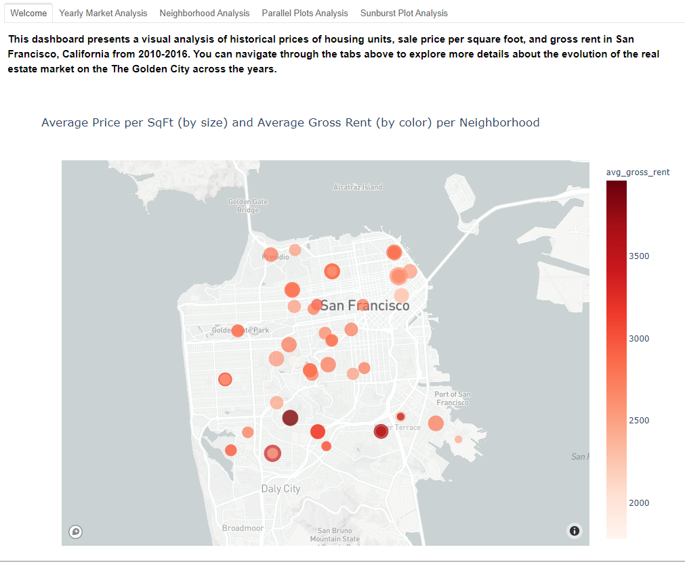
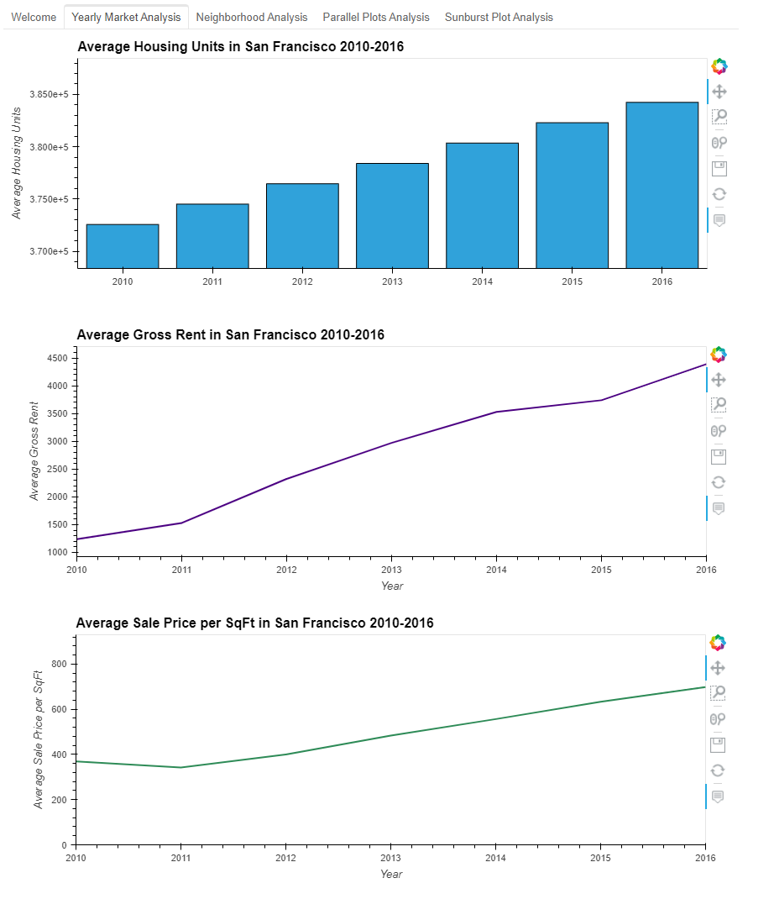
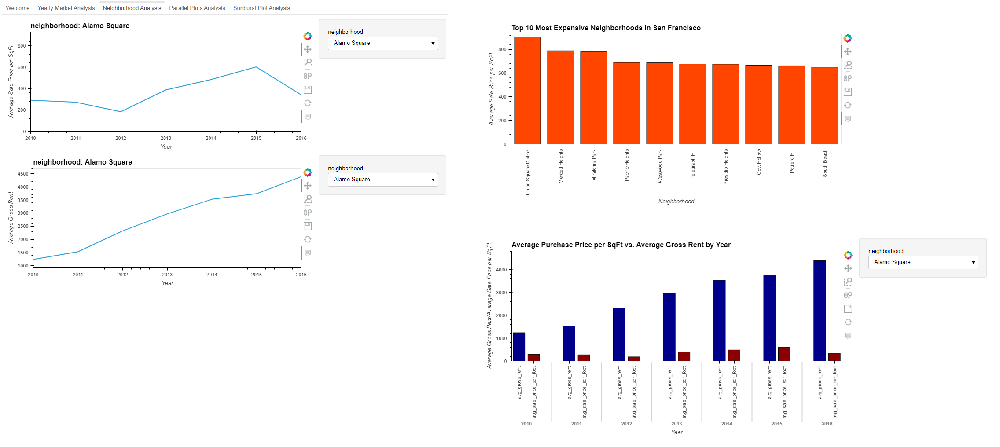
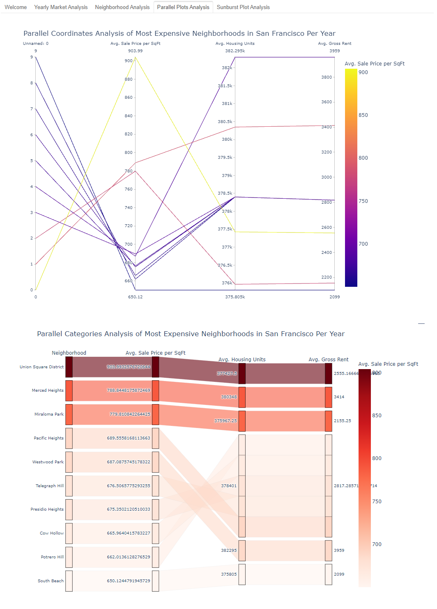
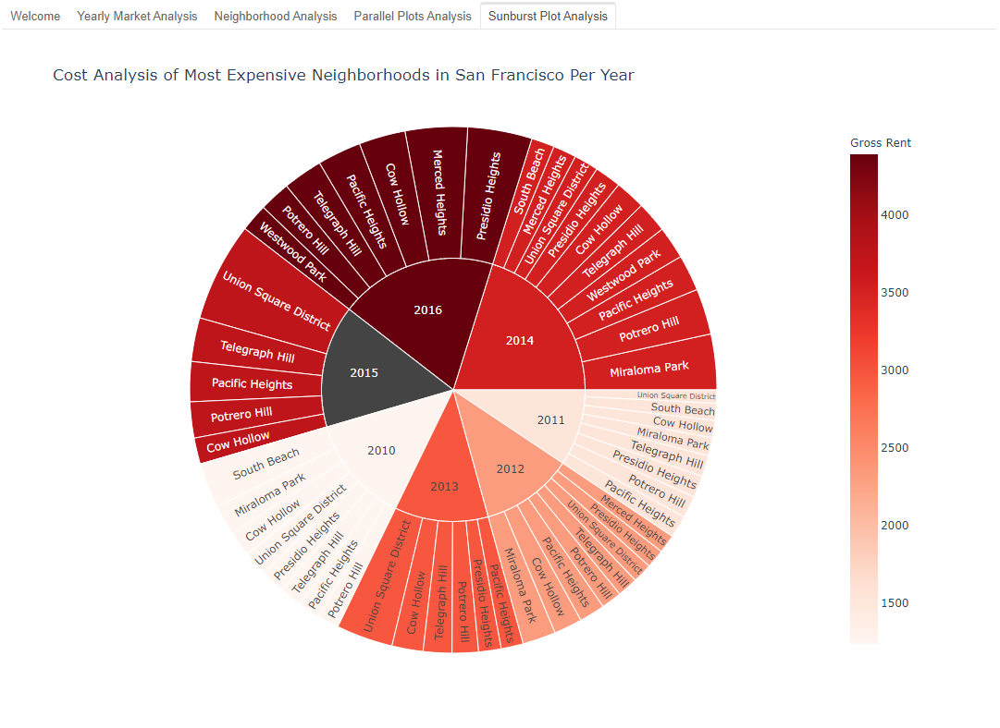

# Real Estate Analysis Dashboard
This repository includes code to create a dashboard to provide customers with information to analyze real estate properties in San Francisco to determine whether to invest. The different tabs in the dashboard present a visual analysis of historical prices of housing units, sale price per square foot, and gross rent in San Francisco, California from 2010-2016. Navigate through the tabs above to explore more details about the evolution of the real estate market on the The Golden City across the years.

Analysis of the data is performed using the "rental_analysis" file, while the dashboard is created using the "dashboard" file. Screenshots of the visualizations on each tab of the dashboard are presented below. Please note that in order to create the map view visualization, an API key from Mapbox is required.

